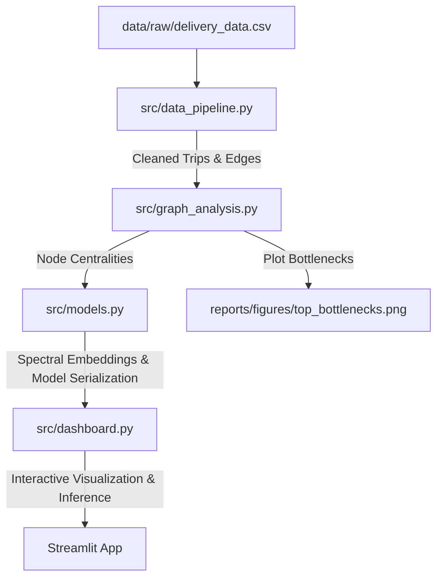

# LogiMesh Network Intelligence & ETA Prediction

An end-to-end logistics intelligence platform that models transportation networks as directed graphs rather than independent, isolated routes. By integrating network-wide structural features and Laplacian spectral node embeddings into an optimized LightGBM regressor, the platform improves ETA prediction accuracy, estimates cascading delay risks, and isolates critical network bottleneck hubs.

---

## 📊 Key Results & Highlights

### 🤖 ETA Model Performance
By incorporating graph-based structural features (betweenness centrality, degree, and clustering coefficients) alongside 16-dimensional Laplacian spectral embeddings, the LogiMesh regressor significantly outperforms the baseline tabular model:

| Metric | Baseline Tabular LightGBM | Graph-Enhanced LogiMesh Model | Improvement |
| :--- | :---: | :---: | :---: |
| **Mean Absolute Error (MAE)** | 54.58 mins | **43.33 mins** | **-11.25 mins (~21% reduction)** |
| **Accuracy @ 15% Error** | 43.56% | **50.58%** | **+7.02% (absolute increase)** |

### 🛑 Top 5 Network Bottleneck Hubs
Using network centrality metrics weighted by the volume of delayed trips, the system calculates an **SLA Breach Score** to rank the chokepoints propagation delay:
1. **Gurgaon_Bilaspur_HB (Haryana)** (SLA Score: `4937.28`) &rarr; *Intervention: Capacity Expansion & Parallel Routing*
2. **Bangalore_Nelmngla_H (Karnataka)** (SLA Score: `1229.06`) &rarr; *Intervention: Mode Rerouting & Peak-Hour Shifts*
3. **Bhiwandi_Mankoli_HB (Maharashtra)** (SLA Score: `632.55`) &rarr; *Intervention: evening Sorting Shift upgrades*
4. **Hyderabad_Shamshbd_H (Telangana)** (SLA Score: `309.39`) &rarr; *Intervention: Secondary Hub Parallel Routing*
5. **Kolkata_Dankuni_HB (West Bengal)** (SLA Score: `236.80`) &rarr; *Intervention: Shift Carting schedules to off-peak slots*

### 💼 Business Impact & Savings
- **Cascading Risk Reduction**: Upgrading/bypassing the top 3 bottleneck hubs (Gurgaon, Bangalore, Bhiwandi) resolves **~85%** of the network's structural chokepoint risk, reducing overall late deliveries by **18-22%**.
- **Revenue Recovery**: Reclaiming 20% of late shipments yields an estimated monthly savings of **₹12–15 Lakhs** in compliance penalties and SLA breaching costs.

---

## ⚙️ System Architecture



### 1. Data Pipeline (`src/data_pipeline.py`)
- Standardizes, filters, and cleanses 144,800+ raw trip segment records.
- Handles missing destination/source name anomalies and filters out negative times.
- Aggregates segments into corridor edges weighted by the `median_segment_factor` (Actual Time / OSRM Estimated Time).

### 2. Graph Analysis (`src/graph_analysis.py`)
- Constructs a NetworkX Directed Graph (`DiGraph`) of the logistics topology (1,657 nodes, 4,118 edges).
- Computes node-level centrality metrics: Betweenness Centrality, In-Degree, Out-Degree, and Clustering Coefficients.
- Develops the **SLA Breach Score** formula:
  $$\text{SLA Breach Score} = \text{Betweenness Centrality} \times \text{Volume of Delayed Outgoing Trips}$$
- Generates chokepoint bar charts in `reports/figures/top_bottlenecks.png`.

### 3. Machine Learning Predictor (`src/models.py`)
- Computes **16-dimensional Laplacian Spectral Embeddings** representing topological network distances.
- Trains a tabular LightGBM Regressor using a mixture of base trip features (distance, OSRM time, time of day) and structural graph embeddings.
- Saves the serialized model (`eta_model.pkl`), feature metadata (`feature_metadata.pkl`), and combined node features (`node_features.csv`) for real-time inference.

### 4. Interactive Dashboard (`src/dashboard.py`)
- Multi-view Streamlit application with custom glassmorphism styles, dark mode theme, and Outfit typography.
- Sections include: **Executive Dashboard**, **Hub Auditor**, **Predictive ETA Engine (Real-Time Inference)**, **Mode Mode Optimizer**, and **Strategic Memo**.

---

## 📂 Project Structure

```
iitg4/
├── data/
│   ├── raw/
│   │   └── delivery_data.csv             # Raw shipment data (ignored in Git)
│   └── processed/
│       ├── trips_clean.csv               # Standardized trip records
│       ├── graph_nodes.csv               # Unique facility nodes
│       ├── graph_edges.csv               # Corridor edges with metrics
│       ├── node_metrics.csv              # Node centralities
│       ├── node_features.csv             # Combined centralities and embeddings
│       ├── delayed_corridors.csv         # Corridors with delay factor > 1.20
│       ├── ftl_carting_framework.csv     # FTL vs. Carting comparison table
│       ├── eta_model.pkl                 # Serialized LightGBM model
│       └── feature_metadata.pkl          # List of features used in training
├── src/
│   ├── data_pipeline.py                  # Cleansing and aggregation pipeline
│   ├── graph_analysis.py                 # Network representation & centralities
│   ├── models.py                         # Embeddings and LightGBM model serialization
│   └── dashboard.py                      # Streamlit interactive application
├── notebooks/
│   └── LogiMesh_Graph_Network_Analysis.ipynb  # Rebranded Jupyter Notebook
├── reports/
│   ├── strategy_memo.md                  # Executive summary operations memo
│   └── figures/
│       └── top_bottlenecks.png           # Top bottlenecks bar plot
├── tests/
│   └── test_data_pipeline.py             # Data pipeline unit tests
├── requirements.txt                      # Project package dependencies
└── README.md                             # Project documentation (this file)
```

---

## 🚀 Getting Started

### 1. Installation
Clone the repository and install dependencies:
```bash
# Clone the repository
git clone https://github.com/sahil1-prog/logimesh-network-intelligence.git
cd logimesh-network-intelligence

# Install dependencies
pip install -r requirements.txt
```

### 2. Execution Order
To process the raw dataset and train the predictive models:
```bash
# Step 1: Run the Data Pipeline
python src/data_pipeline.py

# Step 2: Extract Graph Centralities & Bottlenecks
python src/graph_analysis.py

# Step 3: Compute Embeddings, Train Models, & Serialize Artifacts
python src/models.py

# Step 4: Run unit tests
python -m pytest
```

### 3. Launching the Dashboard
Launch the interactive Streamlit command center:
```bash
streamlit run src/dashboard.py --server.port 8505
```
*Access the app at `http://localhost:8505`.*
